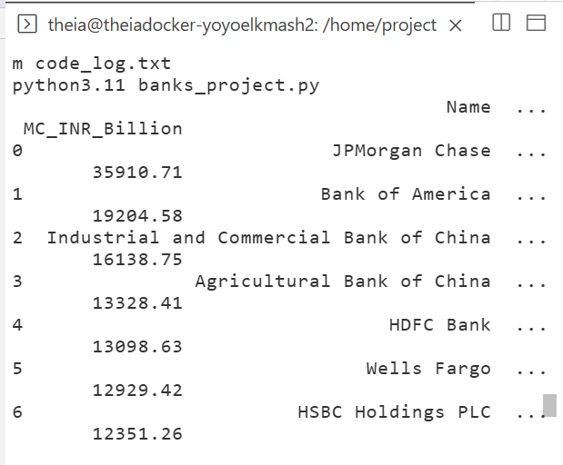

 🏦 Largest Banks ETL Project

📌 Project Overview

This project implements a complete **ETL (Extract, Transform, Load) pipeline using Python** to collect and process data about the world's largest banks by market capitalization.

The pipeline extracts bank data from a web source, transforms the market capitalization values into different currencies, and loads the processed data into both a CSV file and a SQLite database.

🔄 ETL Process

 1. Extract

The project uses:

* **Requests** to retrieve the webpage
* **BeautifulSoup** to parse the HTML data
* **Pandas** to create and process the DataFrame

The extracted data includes:

* Bank Name
* Market Capitalization in USD Billion

2. Transform

The market capitalization values are converted from USD into:

* GBP
* EUR
* INR

The exchange rates are read from `exchange_rate.csv`.

The final dataset contains:

| Column         | Description                  |
| -------------- | ---------------------------- |
| Name           | Bank name                    |
| MC_USD_Billion | Market capitalization in USD |
| MC_GBP_Billion | Market capitalization in GBP |
| MC_EUR_Billion | Market capitalization in EUR |
| MC_INR_Billion | Market capitalization in INR |

 3. Load

The transformed data is loaded into:

CSV File

* `Largest_banks_data.csv`

SQLite Database

* `Banks.db`
* Table: `Largest_banks`

🗄️ SQL Queries

The project executes SQL queries on the SQLite database, including:

* Selecting all bank records
* Calculating the average market capitalization in GBP
* Selecting the first five banks

Example:

```sql
SELECT AVG(MC_GBP_Billion)
FROM Largest_banks;
```

🛠️ Technologies Used

* Python
* Pandas
* NumPy
* Requests
* BeautifulSoup
* SQLite
* SQL
* CSV

 📂 Project Files

* `Bank_project.py` — Main ETL pipeline
* `exchange_rate.csv` — Exchange rates used for currency conversion
* `Banks.db` — SQLite database
* `code_log.txt` — ETL execution log

 🎯 Key Learning Outcomes

Through this project, I practiced:

* Building an end-to-end ETL pipeline
* Web scraping using Requests and BeautifulSoup
* Data manipulation using Pandas
* Numerical transformations using NumPy
* Working with CSV files
* Creating and querying SQLite databases
* Executing SQL queries from Python
* Logging ETL pipeline progress

   📸 Project Output



 👩‍💻 Author

Aya Ahmed El Sayed

Data Engineering Learning Journey 🚀
